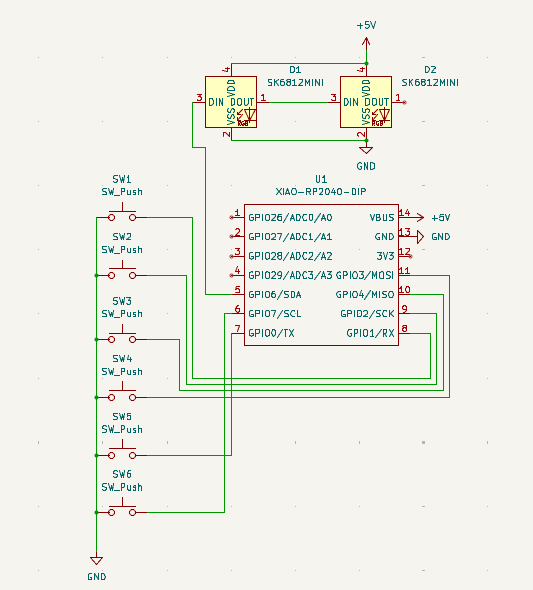
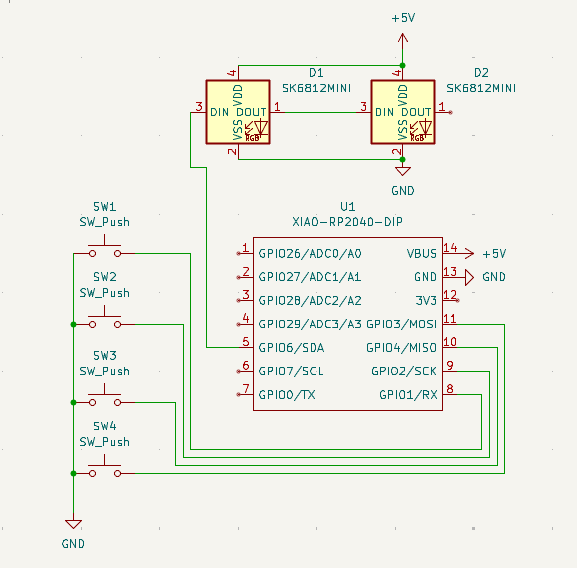
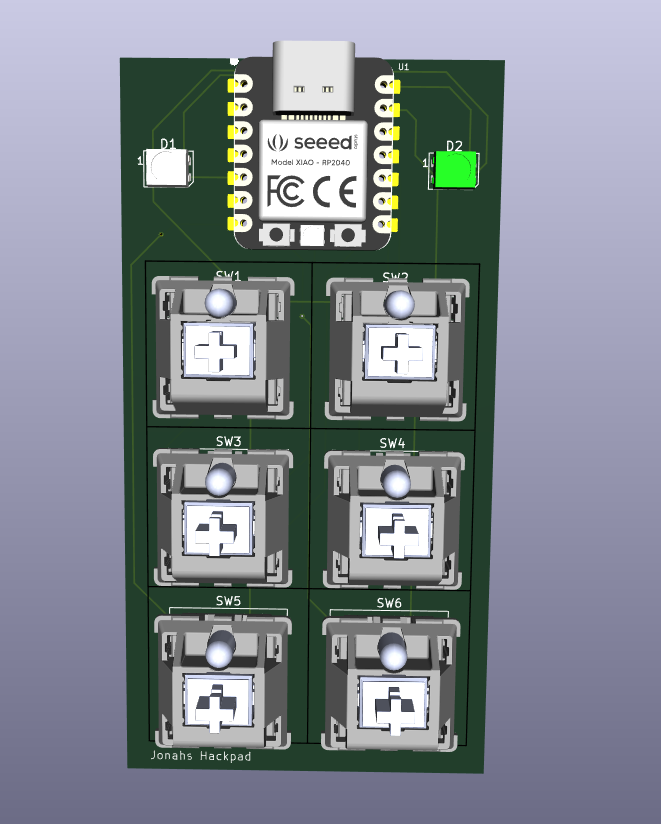

# Jonahs-Hackpad

This is my schamatic i tried to lay everything out neatly so it is easy to make the wire conections

This is my PCB i made everything as compact as posible so it fits nicely on my desk

This is my case I made an angled wedge at the bottom of the case to make it sit ata an angle for easyer key pressing

My super cool 3D PCB board

In the code I have coded the 2 LED's one will be constantly green as a power indcator and the other flashes red for 100ms every time a key is pressed mainly because i think it is cool but it will also help me debud why its not working in the case that it doesent work.

I will be useing:

--> 1x Seeed XIAO RP2040

--> 2x SK6812 MINI-E LED's

--> 4x MX-Style switches

--> 4x Keycaps